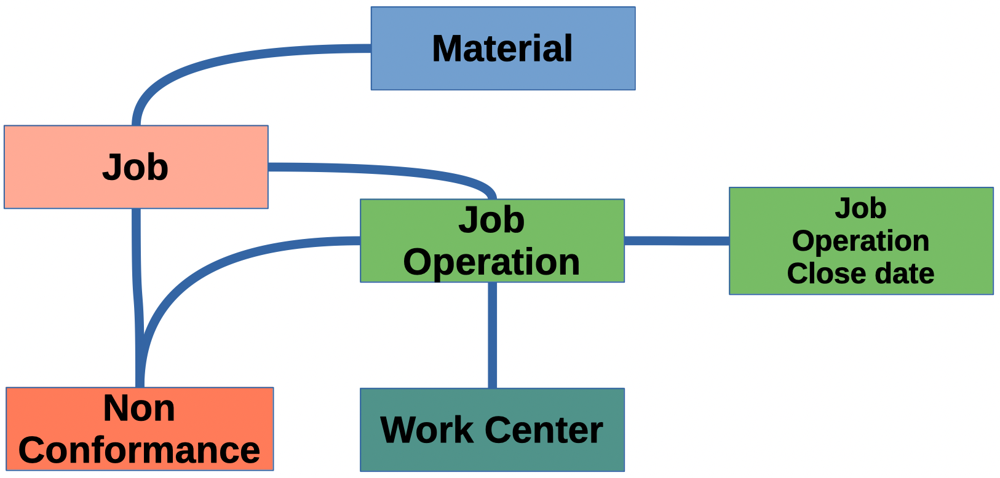

# CMPSCI-305-Database-Systems-Allegheny-College-2023
Final project for Allegheny College's CMPSCI-305 Database Systems class

[](https://classroom.github.com/a/ZgOF86vP)
[](https://classroom.github.com/online_ide?assignment_repo_id=13156404&assignment_repo_type=AssignmentRepo)
# Database Systems (CS305): Final Project Assignment

**Assigned** : Tuesday, 5 December 2023

**Due** : Thursday, 14th December 2023, 7:00pm



## Project Goals

* To work with large-scale *real-world* data from industry.
* To demonstrate proficiency with SQL databases as well as query design and execution.
* To analyze the results of the queries and communicate the trends that are found.
* To produce user-friendly visualizations of the data and query results.

These project goal contribute to the below course learning outcomes described in the syllabus:

1. Correctly describe object-oriented data storage, low-level data storage, transactions and concurrency control, data warehousing and data mining.
2. Design and implement SQL databases and formulate advanced structured queries to extract knowledge from databases.
3. Clearly and persuasively communicate the results of database inquiries and critically examine and reflect on their ethical implications.

# Introduction

In our lab, we had a visit from three speakers from [Acutec](https://acutecprecision.com/) -- a company that machines aerospace parts from metal blocks. One of the main concerns in their industry is that the finalized part that is produced will have faults (incurred due to the quality of metal, production or from other sources). Faults prevent the damaged tool from passing inspections. In this case, any part that does not conform to specifications are labeled as *scrap* and must be destroyed, leading to waste.

# Group Work

This project should be completed in teams (no more than three people in a team), however, you may still choose to work alone. If working in a team, all members of the team are expected to contribute to the project more or less equally, as evidenced by Github *commit history*.

# Project Overview

In this final project, you are to demonstrate your database and analysis skills by studying the data which our speakers have given us. In particular, you are to use the given data to design and execute queries that may provide some type of trend, insight or an association to wasted material, or another resource such as time, material, or another metric.

While this is an open project, where you can explore whatever aspect of the data you like, you must still provide ample discussion using clear and meaningful language (No one-liners, please.) when you introduce your discoveries of trends in your discussion.

# Data

## Contents of the Shared Data Repository

The shared data repository for this project is located on the Google Drive, and can be accessed at [link](https://drive.google.com/drive/folders/1A2rw5fk-xLNoEfMWpfYtPtoRG5OAd07o?usp=drive_link). In the repository, you will find a built database (without primary or foreign key information in the schema) that contains all data from the accompanying `.csv` files. There is a supplied *build* file in case you would like to rebuild your database after editing its schema (also using the *build* file), or if the database has been corrupted in some way and needs to be rebuilt. Note: due to the size of the project data, the database size is about 508 Megabytes. This means that downloading the database may take some time on your machine. In this case, it might be quicker to simply rebuild the database from the data files that you may have already downloaded.

## Study the Data

For this project, the speakers from Acutec gave us an overview of the data that is mentioned above. Please consult your notes from the speakers' talk as necessary to remind you of the different types of data which has been made available to you for this study.

Be sure to make an effort to understand the organization of the tables. In addition, you may want to determine what type of data is offered by each type of table so that you have an idea about the purpose of the table.

Note: You may find that you are unable to define all data attributes in your database. If you are confused about the nature of an attribute, then do not worry! Spend a moment to see how this unknown attribute may be related to the rest of the data in the base. This will help you to determine how the attribute may be used in conjunction with other types of queries.

## Where to Start

In the shared data repository for this project, the supplied data file, `Acutec_datadump_nonconformance.csv`, the attribute, `ColorCurrent` contains the results of the inspection of a particular part. In the supplied database (`acutecDB.sqlite3`), the table `nonconformance` also contains the same information. The word, "RED" is used to signify that a manufactured part was defective and has been "RED Tagged" to remove it from further production. Note, in the supplied database, the table `nonconformance` also contains this same information.

It is highly recommended that you start using this table to note which parts have RED tags. Once you have determined a query to determine the RED fields, continue your work to find what other attributes are connected (related) to these defective tools. Work backward and see where you end up. Please be sure to write down all your thoughts and decisions you make so that your work can be re-traced.

---

## Project Tasks and Deliverables

Your project will concern responding to research questions which you will use Acutec's data to answer. Remember, that this assignment is not so much about being able to analyze data to resolve some issue, but rather, it is to showcase your ability to understand and organize collected data so as to be in the position to perform such an analysis via queries. Your project is therefore to respond to your research questions by using a database system and designing appropriate advanced queries to understand or resolve the questions that you ask of your data.

While you are given a lot of freedom to explore given data, your project must satisfy the following baseline tasks:

1. Use and explain the data provided by Acutec.
2. Create at least five research questions to be answered by the given data to identify some trend in data. These questions and the motivation for their selection must be included in the `writing/research_questions.md` file.
3. Use the `sqlite3` database and explain its schema. For ease of assignment evaluation, please use the database provided to you. If you create your own database, please use the same naming conventions as are in the provided database.
3. Design and execute at least 20 advanced structured queries stored in `src/queries.md` to answer the chosen research questions.
4. Write a project report in `writing/report.md` file that contains:
* an overview of the project (explanation of data, selected research questions and motivation for their selection)
* explanation of the database schema
* overview of the constructed queries
* conclusions from the executed queries, including visual graphs of your results

### Deliverables

Summary of the Required Deliverables. Please submit your work by pushing it to your GitHub project repository.

**Research Questions**: `writing/research_questions.md` file containing your selected research questions and motivation for their selection.
**Database-queries file**: `src/queries.md` file containing all your queries.
**Report**: `writing/report.md` file containing your project report with information as described above.

### Screenshots

If you would like to add screenshots to your work, please use the the following Markdown code;

``` markdown

```

The following html code serves to scale-down your graphic.

``` markdown

```

If you are using VSCode, then you can visualize your completed Markdown file to determine whether your files are present and are displaying in your document.

### Submitting Assignments

As you are working on your lab, you are to commit and push regularly. The commands are the following.

``` bash
git add -A
git commit -m ‘‘Your notes about commit here’’
git push
```

## Project Assessment

The grade that a student receives on this assignment will have the following components.

* **Quality of research questions [up to 25%]**: For this component, the depth of the questions shall be graded. For instance, are the questions actually inquiring into something deep which may stem from some kind of trend in the data. The questions should not be answerable using a *yes* or *no* answer, or by collecting some basic statistical answer such as counting something in a table. Naturally, these types of simple queries may be included in the study, but such queries are not to be considered as overarching *Research questions*.)

* **Mastery of Technical Knowledge and Skills [up to 60%]**: Students will receive a portion of their assignment grade when their program implementation reveals that they have mastered all of the technical knowledge and skills developed during the completion of this assignment. As a part of this grade, the instructor will assess aspects of the programming including, but not limited to, the completeness and the correctness of the program and the use of effective source code comments.

* **Mastery of Technical Writing [up to 15%]:**: Students will receive a portion of their grade for their responses to the writing questions presented in the deliverable Files of the directory `writing/` that reveal a proficiency of both writing skills and technical knowledge. To receive a grade, the submitted writing should have correct spelling, grammar, and punctuation in addition to following the rules of Markdown and providing conceptually and technically accurate answers. There should not be any one-liners present in the responses.

## GatorGrade

### Checks for GatorGrade

For immediate feedback on submissions, we will be using Gator Grade to inform the of missing components in the submission. As you submit, you will notice that there is a thick red X that will change to a green check mark when all components have been included in the submission. You are encouraged to click on the red X to find a listing of the components to address.

You can check the baseline writing and commit requirements for this lab assignment by running the department's assignment checking `gatorgrade` tool. To use `gatorgrade`, you first need to make sure you have Python installed (type `python --version` to check). If you do not have Python installed, please see:

* [Setting Up Python on Windows](https://realpython.com/lessons/python-windows-setup/)
* [Python 3 Installation and Setup Guide](https://realpython.com/installing-python/)
* [How to Install Python 3 and Set Up a Local Programming Environment on Windows 10](https://www.digitalocean.com/community/tutorials/how-to-install-python-3-and-set-up-a-local-programming-environment-on-windows-10)

Then, if you have not done so already, you need to install `gatorgrade`:

* First, [install `pipx`](https://pypa.github.io/pipx/installation/)
* Then, install `gatorgrade` with `pipx install gatorgrade`

Finally, you can run `gatorgrade`:

`gatorgrade --config config/gatorgrade.yml`

## Seeking Assistance

Extra resources for using markdown include;

* [Markdown Tidbits](https://www.youtube.com/watch?v=cdJEUAy5IyA)

* [Markdown Cheatsheet](https://github.com/adam-p/markdown-here/wiki/Markdown-Cheatsheet)

Do not forget to use the above git commands to push your work to the cloud for the instructor to grade your assignment. You can go to your GitHub repository using your browser to verify that your files have been submitted. Please see the TL’s or the instructor if you have any questions about assignment submission.

Students who have questions about this project outside of the lab time are invited to ask them in the course's Discord channel or during instructor's or TL's office hours.
