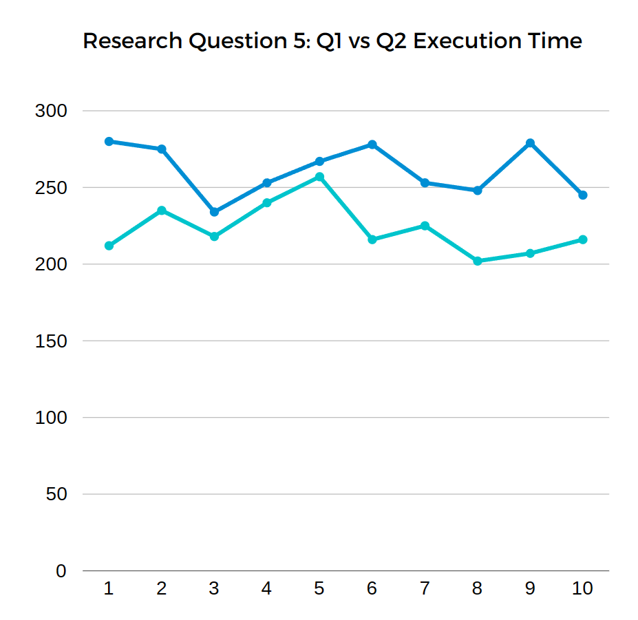
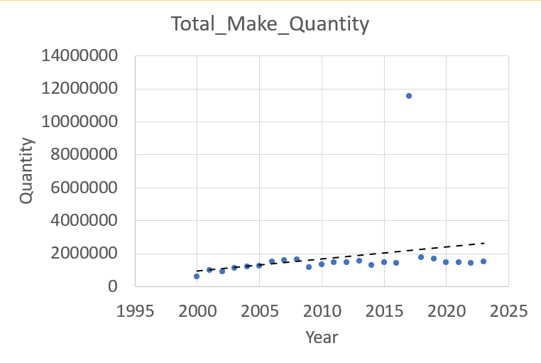

# Final Project

# David Gormley, Ryan Kennedy, Tugi Gantulga

## Report

Please answer the below questions using clear and meaningful language. No one-liners, please.

* Give an overview of the project (explanation of data, selected research questions and motivation for their selection)

The database in question details data from Acutec, a company creating aerospace parts from metal blocks. Within the database, there is information on the various jobs including dates and quantities. There is also information on the current status of jobs as well as information on discarded materials. Because of this large variety of data, we wanted to make sure that the research questions we selected covered multiple bases and allowed us to explore the dataset completely. For that reason, we selected questions that would discuss the data/trends as well as questions that discussed the process of interacting with the data. Question five for example helps us determine the best way to return data from the database which can be useful when we want to efficiently answer more questions in the future.

* Give an explanation of the database schema

The database is split up into 6 sections. With the sections being as follows: "job," "jobmaterial," "joboperation," "joboperationclosedate," "nonconformance," and "workcenter." These 6 tables interact with each other in a variety of ways, mainly through employee IDs, order IDs and dates. The job table contains data on the order dates and the quantity ordered, shipped, made and returned orders. The nonconformance table contains details on assignees and discarded quantities. The job materials table contains information about the material in question and the job operation table contains info on the current status and other related information.

* Explain the overview of the constructed queries

The queries we constructed answer each of our 5 research questions. The queries constructed for the first question show how many parts were considered defective and how many were not. They then show how many defective parts Acutec discarded, but kept for a destructive test, as well as how many nondefective parts they used for the test. The queries used in the second question pertain to how efficient some of the jobs were in the process of making, ordering, picking, shipping, or returning the parts/products. The collection of queries used to answer the third research question details information on how production and order fulfillment at the company have changed over the years. They also show which jobs had the highest production and the average job completion time. The queries answering the fourth research question showcase various ways that queries can be used by warehouses and for business intelligence purposes. The fifth research question's query results detail how changing query design can either slightly or significantly affect execution time.

* What conclusions from the executed queries did you find (including and visual graphs of your results)?

Through the execution of our queries, we are able to conclude that query execution time does matter as shown by This graph. This graph shows the execution time over 10 instances of query 1 and query 2 in research question number 5. Through this graph, we can see that the execution time is consistent despite these two queries doing the same thing. We did not make a graph for queries 3 and 4 however due to the fact that the average distance in the data was so great that as a result, we would just have 2 straight lines as a graph. the x coordinates show the numbered instance we ran it and the y coordinate shows the amount of milliseconds it took to complete.

We were also able to conclude through our other research questions that there were irregularities in the data from 2015 to 2016 when discussing orders. This suggests that either there were errors in how the data was recorded, or the company experienced sudden spikes in orders or production challenges. we also learned how much stock was available in the warehouse as well as the most ordered items, guiding inventory stocking and production prioritization. We also got to learn about the monthly/seasonal patterns or trends in shipment which are useful for planning and resource allocation. We were also able to learn

In our research question one, our results conveyed that a higher amount of parts were considered defective (15542), than not defective parts (4878). Our results then show how most of the defective parts were discarded, and only two were used for destructive testing. Simultaneously, out of the not defective parts, a significantly higher number were discarded for destructive testing. This can possibly indicate that Acutec is efficient at narrowing down parts they feel are the safest to use to ensure no errors occur in their aerospace vehicles.

Finally, we were able to conclude that specifically for the results in research question two, the results conveyed that some jobs were most efficient than others in particular steps in the distribution of the parts/products, but others could be considered most efficient as they contribute to every part in the process. Others were completely inefficient, as they did not contribute to any part of the process at all, some worse than others.

(Did you remember to place your name at the top of this document?)
